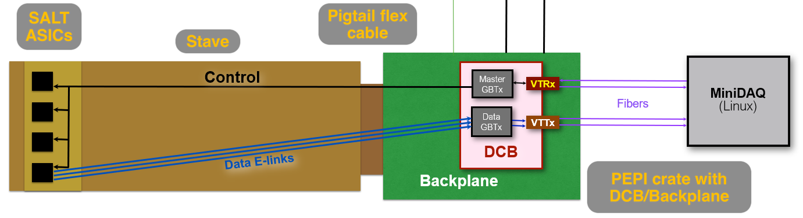
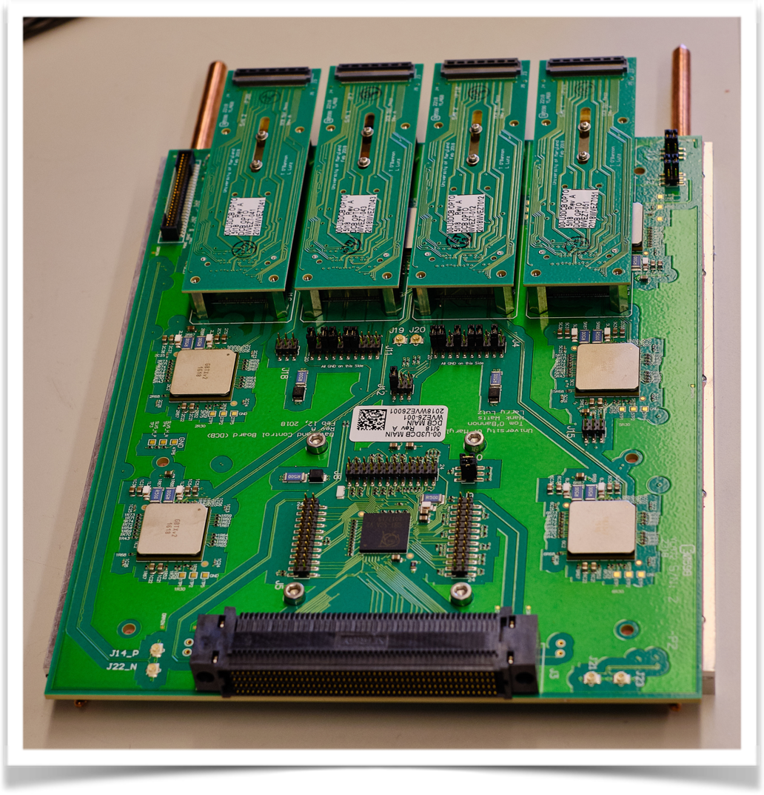
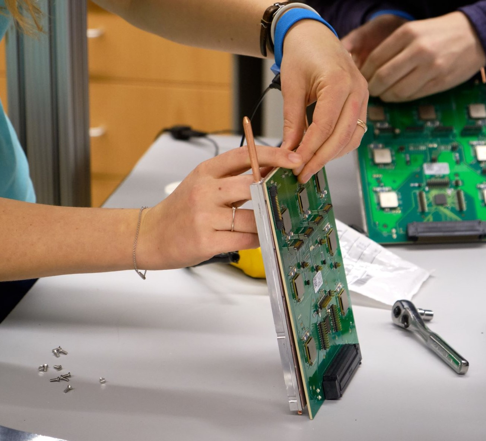

## Function of DCB

The Data and Control Board, DCB, is in charge of data transfer and control signals 
between a stave(link here to UT page) and the data aquisition, DAQ, system.

A model of the setup used at UMD for design and QA of the DCB upgrade, MiniDAQ being a 
stand in for the real DAQ system:

The upgraded DCBs are a projected 3 times faster than previous, allowing a switch from hardware to 
software triggers in the tracking programs used. The goal is to have more usable data from the 
abundance of particles created in LHC.

## Scale

The University of Maryland is responsible for 268 DCBs with 1080 optical mezzanines
and VTT/Rxs attached. The whole thing is attached to a thermal backplate.

Which are assembled by hand

Each DCB is expected to live with minimal maintenance at CERN for the next 10 years. Before being shipped, 
there is an extensive QA process to catch early failures and confirm they are all working as expected.