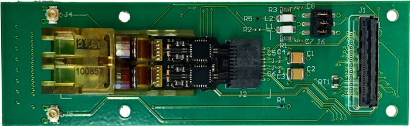

## Definitions and Board Names

There are a lot of acronyms and jargon that are tough to avoid using. This section
will define the important some ones.

ASIC
: Application-Specific Integrated Circuit. These are computer chips special made
  to do one task extremely well.
  
DCB
: Data and Control Board. This is the main backboard discussed on this page.
  Each have 4 optical mezzanines and 4 VTT/Rx.
  

GBTx
: Radiation resistant ASIC serializer-deserializer designed by CERN. 1 master and 
  6 slaves on each DCB.

VTT/Rx
: Radiation resistant optical transceivers/receivers which serve as a direct line 
  to LHCb central data aquisition (DAQ) system. 3 VTTx and 1 VTRx per DCB.
